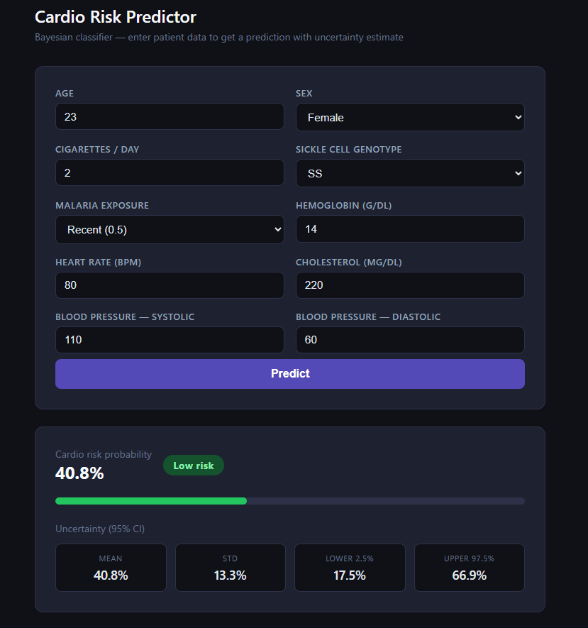

# Bayes_XAI

Bayesian logistic regression classifier for cardiovascular risk prediction, built with NumPyro and JAX. Provides per-prediction uncertainty estimates via posterior sampling (NUTS/MCMC).



## Stack

- **Model** — NumPyro (NUTS sampler), JAX
- **Preprocessing** — scikit-learn pipeline, Pydantic validation
- **API** — FastAPI + Uvicorn
- **Frontend** — vanilla HTML/CSS/JS

## Project structure

```text
src/
  esitmator/        # BayessianClassifier (fit, predict, predict_proba, predict_uncertainty)
  models/           # NumPyro model definition, PatientRecord Pydantic schema
  preprocessing/    # Preprocessor (StandardScaler + OneHotEncoder pipeline)
  server/           # FastAPI app
frontend/           # Static HTML frontend
data/               # Training data (NSH_clear.csv)
fit_model.py        # Train and evaluate, saves figures/evaluation.png
```

## Dataset

[Nigeria Smoking & Health — somtoonkannebe](https://huggingface.co/datasets/somtoonkannebe/Nigeria-smoking-health)

3 900 patient records from Nigeria with demographic, haematological, and cardiovascular features. Target variable is `cardio_risk`, derived from blood pressure, cholesterol, and heart rate thresholds.

## Setup

Requires [uv](https://docs.astral.sh/uv/).

```bash
uv sync
```

## Usage

### Train and evaluate

```bash
uv run python fit_model.py
```

Saves `figures/evaluation.png` with confusion matrix, ROC curve, and uncertainty distribution.

### Run the server

```bash
uv run uvicorn src.server.server:app --host 0.0.0.0 --port 8000
```

- `http://localhost:8000` — frontend
- `http://localhost:8000/predict` — REST endpoint (`POST`)
- `http://localhost:8000/docs` — Swagger UI

### Docker

```bash
just run    # build and start
just down   # stop and remove container
```

## API

`POST /predict`

```json
{
  "age": 45,
  "sex": 1,
  "cigs_per_day": 0,
  "sickle_cell_genotype": "AA",
  "malaria_exposure": 0.0,
  "hemoglobin_g_per_dL": 13.5,
  "heart_rate_bpm": 78,
  "cholesterol_mg_per_dL": 245.0,
  "blood_pressure_upper": 145.0,
  "blood_pressure_lower": 92.0
}
```

Response:

```json
{
  "prediction": 1,
  "probability": 0.81,
  "uncertainty": {
    "mean": 0.81,
    "std": 0.09,
    "lower": 0.63,
    "upper": 0.94
  }
}
```

`sex`: `0` = female, `1` = male
`malaria_exposure`: `0.0` = rare, `0.5` = recent, `1.0` = chronic
